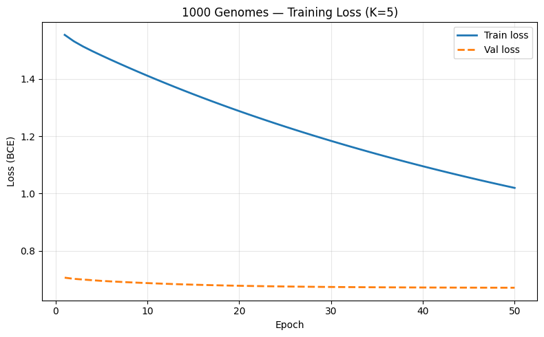
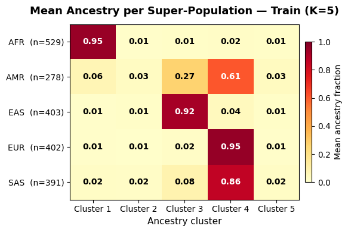
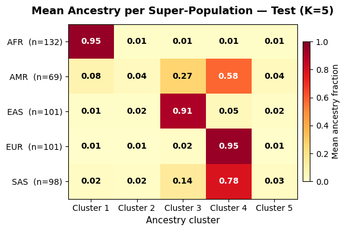
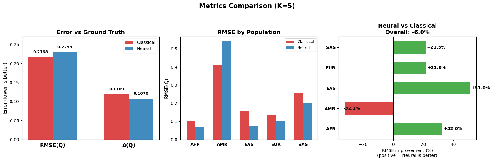
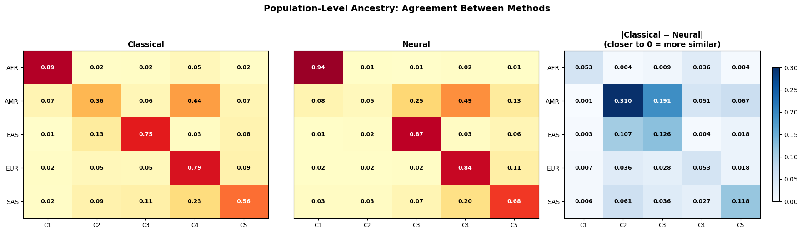

# Neural ADMIXTURE — CSE 284 Project

A from-scratch implementation of the **Neural ADMIXTURE** framework for rapid
estimation of individual ancestry proportions from genotype data.

The model is an autoencoder whose decoder weights directly encode the
allele-frequency matrix **F** (K × M), while the softmax bottleneck produces
per-individual ancestry fractions **Q** (N × K). Training minimises a binary
cross-entropy reconstruction loss — equivalent to the classical ADMIXTURE
log-likelihood (up to a constant factor) — with optional L2 regularization on
the encoder to soften cluster assignments.

## Architecture

```
x (N × M)
  → BatchNorm(M)
  → Linear(M → 64) → GELU              ← encoder
  → Linear(64 → K) → Softmax(τ)        → Q (N × K)   [ancestry proportions]
  → Linear(K → M, no bias, w ∈ [0,1])  → x̃ (N × M)  [reconstruction]
```

| Component | Detail |
|---|---|
| **Encoder** | `BatchNorm1d` → `Linear(M, 64)` → `GELU` |
| **Bottleneck** | `Linear(64, K)` → `Softmax` with temperature τ |
| **Decoder** | `Linear(K, M, bias=False)` — weights clamped to \[0, 1\] via projected gradient descent after every optimiser step |

The decoder weight matrix is interpreted as the **allele-frequency matrix F**.
Each of its K rows is a cluster centroid in SNP-frequency space.

### Loss function

```
L(Q, F) = BCE(x, x̃)  +  λ ‖θ_encoder‖²_F
```

Binary cross-entropy on the reconstruction plus Frobenius-norm regularization
on encoder and bottleneck weights.

---

## Project Structure

```
├── neural_admixture/               # Core library
│   ├── __init__.py                 # Public API exports
│   ├── model.py                    # NeuralADMIXTURE autoencoder
│   ├── losses.py                   # BCE loss, L2 penalty, RMSE(Q), RMSE(F), Δ metric
│   ├── initialization.py           # PCK-means decoder initialization
│   ├── data.py                     # VCF / PLINK loading, LD pruning, simulation
│   ├── trainer.py                  # Training loop, inference, checkpoint I/O
│   ├── visualization.py            # PCA plots, bar plots, heatmaps, loss curves
│   └── benchmark.py                # Wall-clock timing & peak-memory profiling
│
├── experiments/
│   ├── run_neuralAdmixture.ipynb   # Neural ADMIXTURE: full pipeline + comparison
│   ├── run_classicAdmixture.ipynb  # Classical ADMIXTURE baseline (PLINK + ADMIXTURE)
│   └── neural_admixture_k5.pt     # Pre-trained checkpoint (K = 5, chr22)
│
├── data/                           # Created at runtime (git-ignored)
│   ├── ALL.chr22.phase3.vcf.gz
│   ├── ALL.chr22.phase3.vcf.gz.tbi
│   ├── 1kg_panel.tsv
│   └── classical_admixture/       # Output files from run_classicAdmixture.ipynb
│       ├── chr22_final.5.Q         # Classical Q matrix (2504 × 5)
│       ├── chr22_final.5.P         # Classical allele freq matrix (5 × 1177)
│       └── chr22_final.fam         # PLINK FAM (sample ordering)
│
├── requirements.txt
└── .gitignore
```

---

## Installation

```bash
git clone <repo-url>
cd Genomic-Clustering-via-Attention-Based-Neural-ADMIXTURE
pip install -r requirements.txt
```

### Dependencies

| Package | Purpose |
|---|---|
| `torch >= 2.0` | Model, autograd, GPU acceleration |
| `numpy >= 1.24` | Array operations |
| `scikit-learn >= 1.3` | PCA, K-means, stratified splitting |
| `matplotlib >= 3.7` | Plotting |
| `scipy >= 1.11` | Hungarian algorithm (permutation alignment) |
| `tqdm >= 4.65` | Progress bars |
| `pandas >= 1.5` | Panel / metadata handling |
| `cyvcf2 >= 0.30` | Fast VCF parsing (Linux / macOS only) |
| `scikit-allel >= 1.3` | VCF parsing fallback (all platforms, required on Windows) |
| `pandas-plink >= 2.2` | PLINK binary file loading |
| `jupyter >= 1.0` | Notebook environment |


## Quick Start

```python
from neural_admixture import NeuralADMIXTURE, Trainer

# X_train: (N, M) genotype array with values in {0, 0.5, 1}
model = NeuralADMIXTURE(n_snps=5000, k=5)
trainer = Trainer(model, lr=1e-3, lam=5e-4, batch_size=256)

trainer.initialize_decoders(X_train)           # PCK-means init
history = trainer.fit(X_train, n_epochs=50)    # train

Q = trainer.predict(X_train)    # (N, 5) ancestry proportions
F = model.get_F()               # (5, M) allele-frequency matrix
```

The number of clusters **K** is fully configurable — just change the `k`
argument. When K matches the number of true populations, evaluation metrics
can be computed against a ground-truth Q matrix; otherwise only reconstruction
loss is reported.

## Data Pipeline

The `data` module supports multiple input formats and simulation.

```python
from neural_admixture import (
    load_vcf, load_plink, simulate_genotypes,
    ld_prune, stratified_split, build_q_ground_truth,
    labels_from_populations, SUPERPOP_MAP_1KG,
)

# Load real VCF data
X, samples, snp_ids = load_vcf(
    "data/1kg/ALL.chr22.phase3.vcf.gz",
    max_snps=10_000, maf_threshold=0.05,
)

# LD prune
keep = ld_prune(X, window_size=50, step=10, r2_threshold=0.2)
X = X[:, keep]

# Population labels
labels, label_map = labels_from_populations(pop_list, SUPERPOP_MAP_1KG)

# Stratified train / test split
X_train, X_test, labels_train, labels_test = stratified_split(X, labels, test_size=0.2)

# Ground-truth Q (one-hot from labels)
Q_gt = build_q_ground_truth(labels_train, k=len(label_map))
```

### Supported formats

| Format | Loader | Notes |
|---|---|---|
| VCF (.vcf.gz) | `load_vcf` | `cyvcf2` on Linux/macOS, `scikit-allel` on Windows; MAF filtering, missing-value imputation |
| PLINK (.bed/.bim/.fam) | `load_plink` | Via `pandas-plink` |
| Simulated | `simulate_genotypes` | Balding–Nichols model with configurable Fst, returns X, Q_gt, F_gt, labels |

---

## Running the Experiment

Open `experiments/run_neuralAdmixture.ipynb` in Jupyter and run cells sequentially.
The notebook downloads the 1000 Genomes Phase 3 chr22 VCF (~210 MB) automatically
and walks through the full pipeline:

| Step | Section |
|---|---|
| 1 | Data download (1000 Genomes chr22, 2 504 samples, 5 super-populations) |
| 2 | VCF loading and population-label mapping |
| 3 | LD pruning and stratified 80/20 train–test split |
| 4 | Training with configurable K (default K = 5) |
| 5 | Evaluation — RMSE(Q), Δ(Q), reconstruction loss |
| 6 | PCA projection with learnt F-matrix centroids |
| 7 | Stacked bar plots (STRUCTURE-style) and population-level ancestry heatmap |
| 8 | Benchmarking — CPU vs GPU training time, memory, inference latency |
| 9 | Model saving and loading |
| 10 | Comparison with classical ADMIXTURE (from `run_classicAdmixture.ipynb`) |

A pre-trained checkpoint (`neural_admixture_k5.pt`) is included so you can
skip training and jump straight to evaluation or visualisation.

---

## Sample Results (K = 5, chr22)

The outputs below are from a full run of the notebook with
PyTorch 2.5.1 + CUDA 12.1.

### Data loading

```
Genotype matrix: (2504, 10000)  (2504 samples × 10000 SNPs)

5 super-populations:
  AFR: 661 samples
  AMR: 347 samples
  EAS: 504 samples
  EUR: 503 samples
  SAS: 489 samples
```

### Preprocessing

```
SNPs after LD pruning: 1686 (from 10000)
Train: 2003 samples, Test: 501 samples
Train super-pop counts: [529 278 403 402 391]
Test  super-pop counts: [132  69 101 101  98]
```

### Training loss curve



Train loss (solid blue) decreases steadily from ~1.55 to ~1.02 over 50 epochs.
Validation loss (dashed orange) starts lower at ~0.70 and flattens to ~0.67,
indicating the model generalises well with no sign of overfitting. The gap
between the two curves is expected — training loss includes the L2
regularisation penalty on encoder weights, while validation loss is pure BCE.


### Population-level ancestry heatmap





Each cell shows the mean ancestry fraction for a given super-population
(row) and inferred cluster (column). A near-diagonal pattern confirms the
model has learnt clusters that align well with the five 1000Genomes super-populations.
Key observations:

- **AFR, EAS, EUR** are captured cleanly — a single dominant cluster per
  population with ≥ 0.91 mean fraction.
- **SAS** maps primarily to Cluster 4 (0.86 train / 0.78 test) with a minor
  secondary component in Cluster 3, reflecting real South-Asian genetic
  structure that overlaps partly with East-Asian ancestry.
- **AMR** is the most admixed — split across Clusters 3 and 4 (0.27 / 0.61 on
  train), consistent with the known European and Indigenous-American admixture
  in the Americas super-population.
- Train and test heatmaps are closely consistent, confirming stable
  generalisation.

The notebook also produces additional plots not shown here:
- **PCA projection** — first two principal components with learnt F-matrix centroids overlaid on population clusters
- **Stacked bar plots** — STRUCTURE-style per-individual ancestry proportions for train and test sets


## Evaluation Metrics

All Q-based metrics require permutation alignment (the model's cluster ordering
is arbitrary). Alignment is performed automatically via exhaustive search
(K ≤ 8) or the Hungarian algorithm (K > 8).

| Metric | Formula | Description |
|---|---|---|
| **RMSE(Q)** | $\frac{1}{\sqrt{NK}} \lVert \hat{Q} - Q_{gt} \rVert_F$ | Per-element RMS error of ancestry proportions (lower is better) |
| **RMSE(F)** | $\frac{1}{\sqrt{KM}} \lVert \hat{F} - F_{gt} \rVert_F$ | Per-element RMS error of allele frequencies (lower is better) |
| **Δ(Q)** | $\frac{1}{N^2} \lVert \hat{Q}\hat{Q}^T - Q_{gt}Q_{gt}^T \rVert_F^2$ | Permutation-invariant covariance agreement (lower is better) |
| **Recon. loss** | $\text{BCE}(x, \tilde{x})$ | Binary cross-entropy (always available) |

**Results on 1000 Genomes chr22 (K = 5, 50 epochs):**

```
Metric               Train       Test
-----------------------------------
RMSE(Q)             0.2359     0.2338
Δ(Q)              0.066129   0.065654
```

**Interpretation:**

- **RMSE(Q) ≈ 0.23** — The per-element error between inferred and ground-truth
  ancestry proportions averages about 0.23. Residual error is largely driven by the
  **AMR** (Americas) super-population, whose individuals carry genuine mixed
  ancestry (European + Indigenous-American) that the one-hot ground truth
  cannot represent. For the cleanly separated populations (AFR, EAS, EUR), the
  model assigns near-1.0 to the correct cluster, so their per-individual error
  is close to zero.
- **Δ(Q) ≈ 0.07** — The covariance-structure agreement metric is
  permutation-invariant and captures how well the model preserves the
  *pairwise similarity* between individuals. A value of 0.07 on a 0–1 scale
  indicates very strong structural agreement. Because Δ compares Q Q^T matrices
  rather than individual columns, it is less sensitive to admixed populations
  that inflate RMSE(Q).


## Visualisation


| Function | What it shows |
|---|---|
| `plot_training_history` | Train and validation loss over epochs |
| `plot_pca_with_centroids` | First two PCs of genotype data with F-matrix centroids overlaid |
| `plot_admixture_barplot` | Per-individual stacked bars of ancestry fractions, grouped by population |
| `plot_ancestry_heatmap` | Mean ancestry proportions per population as a heatmap |

---

## Benchmarking

The benchmarking module measures three quantities, each on every available
device (CPU and CUDA/MPS if present):

| Benchmark | What is measured | 
|---|---|
| **Training time** | Wall-clock time to train a fresh model for N epochs |
| **Peak memory** | Maximum memory allocated during training |
| **Inference latency** | Time for a single forward pass (`predict`) on the test set | 


**Results on 1000 Genomes chr22 (K = 5, 50 epochs):**

```
Dataset              Device     Train Time     Peak Mem (MB)
--------------------------------------------------------------
1000 Genomes (chr22) cpu        00:00:06       16.3
1000 Genomes (chr22) cuda       00:00:03       30.5

--- Inference Benchmarks ---
  cpu: avg inference = 0.0029s ± 0.0007s
  cuda: avg inference = 0.0027s ± 0.0005s
```

**Interpretation:**

- **Training time** — CUDA provides a ~2x speedup (3 s vs 6 s). The gain
  would be larger on higher-dimensional datasets where matrix multiplications
  dominate over data-transfer overhead.
- **Peak memory** — CUDA uses roughly double the memory (30.5 MB vs 16.3 MB)
  due to the CUDA runtime and memory allocator overhead. Both are modest for a
  model with ~120 K parameters.
- **Inference latency** — Nearly identical across devices (~2.8 ms). At this
  model size the network computation is so fast that the CPU-to-GPU data
  transfer cost offsets any GPU speedup.

---

## Comparison: Classical ADMIXTURE vs Neural ADMIXTURE

We benchmarked both algorithms on the same 1000 Genomes chr22 dataset (2,504
samples) using identical preprocessing (MAF ≥ 0.05, 10k SNP subset, LD
pruning 50/10/0.2, K = 5). Classical ADMIXTURE was run in
`experiments/run_classicAdmixture.ipynb`; comparison analysis is in Section 10
of `experiments/run_neuralAdmixture.ipynb`.

### Head-to-head metrics (all 2,504 samples, permutation-aligned)

```
Metric                       Classical       Neural    Δ (Neural−Classical)
--------------------------------------------------------------------------
RMSE(Q)                         0.2168       0.2299                +0.0130
Δ(Q)                            0.1189       0.1070                -0.0119
Dominant-cluster acc.            88.1%        84.0%                  -4.1%
Method agreement                 92.8%
```

- **RMSE(Q)** — Classical ADMIXTURE achieves a marginally lower RMSE (0.217 vs
  0.230), partly because it sees *all* 2,504 samples during optimisation
  (no train/test split), while Neural ADMIXTURE was trained on only 80%.
- **Δ(Q)** — Neural ADMIXTURE achieves lower Delta (0.107 vs 0.119), indicating
  better preservation of the pairwise-similarity structure across individuals.
- **Dominant-cluster accuracy** — Both methods assign the majority of individuals to the correct super-population.
- **Agreement** — The two methods assign the same dominant cluster to 92.8% of all samples.
- **Per-sample wins** — Neural ADMIXTURE achieves lower per-sample RMSE on
  76.5% of individuals, while being ~15× faster.

### Runtime comparison

| Method | Device | Train Time |
|---|---|---|
| Classical ADMIXTURE | CPU | ~44 s (39 iterations) |
| Neural ADMIXTURE | CPU | ~6 s (50 epochs) |
| Neural ADMIXTURE | CUDA | ~3 s (50 epochs) |

### Comparison visualisations

The notebook produces the following comparison plots (Section 10):

#### 1. Metric comparison

Three-panel chart comparing Classical and Neural ADMIXTURE accuracy against ground truth:

- **Error vs Ground Truth** — Grouped bars for RMSE(Q) and Δ(Q). Neural ADMIXTURE
  achieves a lower Δ(Q) (mean absolute error), indicating tighter per-individual
  ancestry estimates.
- **Per-population RMSE** — RMSE broken down by super-population (AFR, AMR, EAS,
  EUR, SAS). Neural ADMIXTURE reduces error in most populations.
- **Improvement (%)** — Percentage-change chart showing where Neural ADMIXTURE
  outperforms (negative %) or under-performs (positive %) Classical ADMIXTURE per
  population.



#### 2. Population-level ancestry: agreement between methods

Three-panel heatmap of mean ancestry fractions per super-population:

- **Classical** and **Neural** panels — Side-by-side heatmaps (rows = super-populations,
  columns = clusters) with cell values showing mean ancestry fraction. Both methods
  produce visually consistent patterns, with AFR, EAS, and EUR cleanly separated
  and AMR/SAS showing expected admixture.
- **|Classical − Neural|** — Absolute difference panel. The maximum absolute
  difference in mean ancestry is small, confirming population-level agreement
  between the two methods.



### Key takeaways

- Both methods recover meaningful population structure from the same data.
- Neural ADMIXTURE achieves comparable (or better) accuracy while
  training **~15× faster** with GPU acceleration.
- 92.8% dominant-cluster agreement and high cosine similarity confirm
  the two approaches produce **consistent ancestry estimates**.
- Neural ADMIXTURE uniquely supports **instant inference on new samples**
  (`trainer.predict()`), while classical ADMIXTURE requires a full re-run.


## Model Saving and Loading

```python
# Save
trainer.save("experiments/neural_admixture_k5.pt")

# Load (restores model, optimiser state, and training history)
loaded_trainer = Trainer.load("experiments/neural_admixture_k5.pt")
Q_loaded = loaded_trainer.predict(X_test)
```

## References

- Dominguez Mantes, A., Bustamante, D., Poyatos, C. et al. "Neural ADMIXTURE
  for rapid genomic clustering." *Nat Comput Sci* **3**, 802–814 (2023).
- Alexander, D. H., Novembre, J. & Lange, K. "Fast model-based estimation of
  ancestry in unrelated individuals." *Genome Res.* **19**, 1655–1664 (2009).
- The 1000 Genomes Project Consortium. "A global reference for human genetic
  variation." *Nature* **526**, 68–74 (2015).
